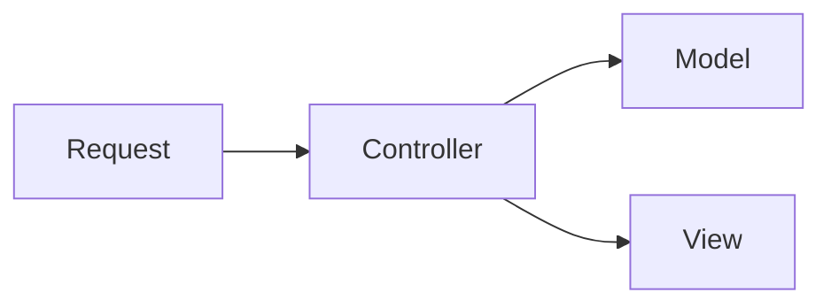

 

# 状态管理

## 传统MVC架构的缺陷

#### 什么是MVC

`MVC`全名是`Model View Controller`，是模型-视图-控制器的缩写，是一种软件设计典范。

`v`即view视图是指用户看到并与之交互的界面

`M`即模型是管理数据，很多业务逻辑都是在模型中完成的。在MVC的三个组件中，模型拥有最多的处理任务

`C` 即控制器是指控制器接受用户的输入并调用模型和视图去完成客户的需求，控制器本身不输出任何东西和坐任何处理。他只是接收请求并决定调用哪个模型构件去处理请求，然后再确定用哪个视图来显示返回的数据。

#### MVC看起来很美

MVC框架的数据流很理想，请求吸纳到Controller，由Controller调用Model中的数据交给View进行渲染，但是在实际的项目中，又是允许Model和View直接通信的。然后就出现这样的结果：

## Flux

在2013年，FaceBook让`react`亮相的同时推出了Flux思想，`react`的初中实际上是用来替代`jQuery`的，`Flux`实际上可以用来替代`Backbone.js`,`Ember.js`等一系列`MVC`架构的前端JS框架

其实`Flux`在`React`里的应用就类似于`Vue`中的`Vuex`的作用，但是在`Vue`中，`Vue`是完整的`mvvm`框架，儿`Vuex`只是全局插件。

`React`只是一个MVC中的V（视图层),只管页面中的渲染，一旦有数据管理的时候，`React`本身的能力就不足以支撑复杂的组件结构项目，在传统的`MVC`中，就需要用到Model和Controller。Facebook对于当时市面上的`MVC`框架并不满意，于是就有了`Flux`,但是`Flux`并不是一个`MVC`框架，它是一种**新的思想**。

+ View 视图层
+ ActionCreator(动作创造者)：视图层发出的消息（比如mouseClick）
+ Dispatcher（派发器）：用来接收Actions、执行回调函数，描述动作长成什么样子，通过dispatcher把描述弹出去。描述长啥样呢，比如用户的一个动作，如添加到购物车，动作描述类似于一个tap，这个对象的第二个是商品信息，
+ Store（数据层）：用来存放应用的状态，一旦发声变动，就提醒Views要更新页面

Flux的流程：

1. 组件获取到store中保存的数据挂载在自己的状态上
2. 用户产生了操作，调用actions方法
3. actions接收到了用户的操作，进行一系列的逻辑代码、异步操作
4. 然后actions会创建出对应的action，action带有标识性属性
5. actions调用dispatcher的dispatch方法将action传递给dispatcher
6. dispatcher接收到action并根据表示信息判断之后，调用store的更改数据的方法
7. store的方法被调用后，更改状态，触发事件
8. store更改状态后事件被处罚，事件的处理程序会通知view获取最新的数据

## Redux（Flux的一种实现）

React只是DOM的一个抽象层 ，并不是Web应用的完整解决方案。有两个方面他没涉及。

+ 代码结构
+ 组件之间的通信

2013年Facebook提出了Flux架构的思想，引发了很多实现。2015年，Redux出现，将Flux与函数式编程结合一起，很短时间内就成为了最热门的前端架构。

##### Redux的设计思想：

1. Web应用是一个状态机，视图与状态是一一对应的
2. 所有的状态，保存在一个对象里面（唯一数据源）

> 注意：flux，redux都不是必须和react搭配使用的，因为flux和redux是完整的架构，在学习react的时候，只是将react的组件作为redux中的视图层去使用

##### Redux的使用的三大原则

+ Single Source of Truth(唯一数据源)
+ State is read-only(状态时只读的)
+ Changes are made with pure function(数据改变必须通过纯函数)

### 自己实现Redux